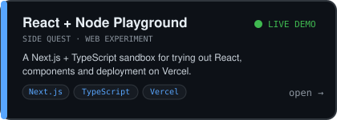
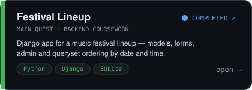
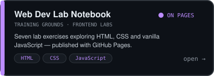
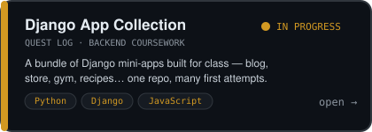
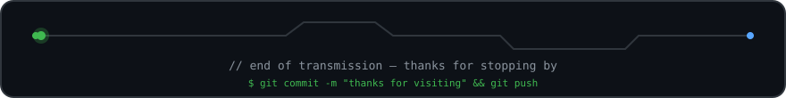
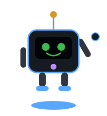

<!-- ============================================================
     Hello, source reader. You found easter egg #1.
     Bit (the robot) says: curiosity is a feature, not a bug.
     ============================================================ -->

<div align="center">



<br/>

`olá! 👋` &nbsp;welcome to my little corner of GitHub

</div>

## `$ whoami`

I'm **Gonçalo**, a Computer Engineering student from Portugal 🇵🇹.

I'm still early in my journey, and honestly, that's the fun part — everything here is an experiment. I build small things, break them, read the error messages (eventually), and come back knowing a bit more. Main quest: finish the degree. Side quest: build something that survives production.

## `$ currently-exploring`

```text
┌─ NOW LOADING ────────────────────────────────────────┐
│ ▸ Django ........... deeper into models, forms, auth │
│ ▸ Next.js + TS ..... components, routing, deploys    │
│ ▸ Git .............. branching without fear          │
└──────────────────────────────────────────────────────┘
```

<!-- TODO(Gonçalo): confirma/ajusta esta lista ao que estás mesmo a estudar este semestre -->

## `$ cat loadout.txt`

```text
[ USED IN PROJECTS ]   Python · Django · JavaScript · TypeScript
                       React/Next.js · HTML · CSS · SQLite · Git

[ LEARNING NOW ]       Better Django patterns · TypeScript · REST APIs

[ WANT TO EXPLORE ]    [PLACEHOLDER: ex. Docker, C, mobile — escolhe 2-3]
```

## 🕹️ Side Quests — projects & experiments

<table>
<tr>
<td>
<a href="https://github.com/goncalooliveira03/brincarcomreactenode">

</a>
</td>
<td>
<a href="https://github.com/goncalooliveira03/festival-form-a22407799">

</a>
</td>
</tr>
<tr>
<td>
<a href="https://github.com/goncalooliveira03/goncalooliveira03.github.io">

</a>
</td>
<td>
<a href="https://github.com/goncalooliveira03/Goncalo_Oliveira_a22407799">

</a>
</td>
</tr>
</table>

**Bonus round:** [LLMRockPaperScissors](https://github.com/goncalooliveira03/LLMRockPaperScissors) — a fork where an LLM plays rock-paper-scissors. I poked at it to see how Java talks to a language model. The LLM still loses to random chance sometimes, which is oddly comforting.

## 📜 Current Quests

- [x] Survive another semester of Computer Engineering
- [ ] Ship a personal project that isn't coursework
- [ ] Write a proper README for every repo (the irony is not lost on me)
- [ ] <!-- TODO(Gonçalo): acrescenta 1 objetivo real teu -->

## 📈 Activity

<picture>
  <source media="(prefers-color-scheme: dark)" srcset="https://raw.githubusercontent.com/goncalooliveira03/goncalooliveira03/output/github-snake-dark.svg">
  
</picture>


## 🧾 Dev Log — auto-updated

<!--DEVLOG:START-->
> Loading first log entry… (the update workflow will replace this line)
<!--DEVLOG:END-->

<sub>↑ this quote rotates weekly via GitHub Actions, so the profile never fully sleeps.</sub>

<details>
<summary>🎮 <b>PRESS START</b> — hidden level</summary>

<br/>

<div align="center">

</div>

```text
ACHIEVEMENT UNLOCKED: You clicked a collapsed section on a stranger's profile.
That's exactly the kind of curiosity I respect.

Fun fact: my first "it works!" moment was followed, 30 seconds later,
by my first "why does it not work anymore?!" moment. Still chasing that ratio.
```

</details>

## 📬 Contact

The terminal is always open:

- 💼 LinkedIn: [PLACEHOLDER: adiciona o link do teu LinkedIn]
- 📧 Email: [goncaloro@gmail.com](mailto:goncaloro@gmail.com) <!-- confirma se queres o email público -->
- 🐙 Right here on [GitHub](https://github.com/goncalooliveira03)

<div align="center">





<sub>hand-built SVGs, no template · © whenever, Gonçalo Oliveira</sub>

</div>

<!-- easter egg #2: if you read this far, Bit has already unlocked the
     "recruited a curious human" achievement. Say hi — I reply. -->
